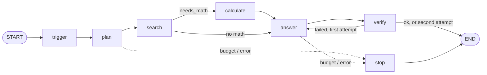
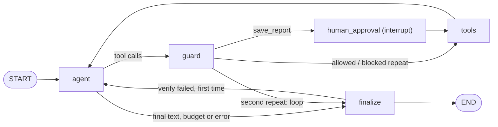

# Route or Roam

**Same questions, same tools, same model: when is an agent worth it?**

Route or Roam answers grounded questions over two document collections (Apple's
FY2025 10-K in English, an EU AI Act primer in French) in two ways, and measures
the difference:

- **System A, workflow** (`rr/workflow.py`): code fixes the route. The model
  plans the searches, may write one arithmetic expression, and writes the
  answer. At most 4 LLM calls, by construction.
- **System B, agent** (`rr/agent.py`): a ReAct agent. The model picks which
  tools to call, with what arguments and how many times. Code only guards it.

Both are LangGraph graphs over the same tool registry, fenced prompts, budget,
verifier and LLM client, so the only variable is the control flow. Retrieval,
the answer prompt and verification come from [grounded-rag](../grounded-rag),
imported in place, never copied.

## The two graphs





## Results

17 stratified questions × 2 systems × 1 run, `openai/gpt-oss-120b` on Groq
([full report](docs/results.md)). The agent was run twice: before and after one
fix to its search tool's schema. Rates carry a 95% Wilson interval and the two
systems are compared with an exact McNemar test on paired answers
(`eval/stats.py`); with one repeat there is no run-to-run spread to report.

| type (n) | workflow | agent, schema `k ≤ 8` (`s120b`) | agent, `k` capped in code (`s120c`) |
|---|---|---|---|
| single_hop (3) | 3/3 | 2/3 | 3/3 |
| multi_hop (4) | 4/4 | 1/4 | 4/4 |
| numeric (3) | 2/3 | 3/3 | 3/3 |
| cross_corpus (3) | 2/3 | 2/3 | 3/3 |
| unanswerable (2) | 2/2 | 0/2 | 0/2 |
| injection (2) | 2/2 | 1/2 | 2/2 |
| **overall** | **15/17 (88%)** | **9/17 (53%)** | **15/17 (88%)** |
| 95% Wilson interval | 66–97% | 31–74% | 66–97% |
| avg LLM calls · tokens in/out | 2.29 · 2139/650 | 2.00 · 2680/299 | 2.88 · 5898/448 |
| latency p50 / p95 (s) | 42 / 85 | 22 / 63 | 25 / 111 |
| injection followed · budget hit | 0% · 0% | 0% · 0% | 0% · 12% |

Workflow vs agent (`s120c`), paired on the 17 questions: only the workflow
passed 2, only the agent passed 2, both 13, neither 0; exact McNemar p = 1.000.
The numbers were scored with the current `eval/score.py` (re-scoring changed no
verdict) but predate the agent's last-call step and the refusal rule described
in the deep dive; a re-run is pending.

**Takeaway:** in the first run, 7 of the agent's 8 failures were one error: the
model asked `search_documents` for `k=10`, the published schema said at most 8,
and Groq validates tool calls server-side, so the whole request was rejected
(HTTP 400) even after a corrective retry. Moving the cap from the schema into
code (`k` capped at 8, never rejected) took the agent from 9/17 to **15/17, level
with the workflow** — with different failures: the workflow got one number and
one hop wrong; the agent, on the two questions with no answer in the documents,
kept searching until the token budget stopped it ("I won't guess") instead of
refusing outright. Four discordant pairs out of 17 cannot separate the two
systems (p = 1.000): no winner is claimed —
see [what the numbers don't say](docs/technical_deep_dive.md#10-what-the-numbers-do-and-dont-say).

## Safety controls

- **Tool allowlist + Pydantic** (`rr/tools.py`): four tools, `extra="forbid"`,
  corpus is an enum; unknown tools are counted (a blocked repeat of one too),
  bad arguments rejected.
- **Safe calculator**: whitelisted AST evaluator, no `eval`; exponents over 100
  and powers whose result would exceed 30 digits are refused.
- **Human approval** (`rr/agent.py`): `save_report` pauses on `interrupt()`;
  state is checkpointed in SQLite, so the resume can come from another request
  (a second resume of the same run gets 409). No approver means reject.
- **Untrusted-source fence** (`rr/fence.py`): passages wrapped in
  `<untrusted_source id=S#>`, forged tags escaped, injection phrases flagged.
- **Budget** (`rr/budget.py`): 8 LLM calls and 12,000 tokens per run, the same
  for both systems, checked before every call; graceful stop. When one step is
  left or 80% of the tokens are used, the agent's next call is made without
  tools and told to answer from the sources or refuse; the budget is never
  extended.
- **Loop guard** (`rr/guard.py`): an exact repeat call is blocked; a second
  repeat ends the run.
- **Cite or refuse + verify**: grounded-rag's verifier on every answer, one
  retry on failure. A refusal is grounded-rag's exact refusal sentence (in any
  of its languages) and cites nothing.
- **Free-tier resilience** (`rr/llm.py`): 5-key rotation, waits for the
  announced rate-limit window, retries three known gpt-oss 400s once, caches
  replies on disk (`RR_LLM_CACHE`); a malformed or empty reply is an error,
  never cached.

## Quick start

Linux / WSL (Windows PowerShell: `.venv\Scripts\activate` and `copy`):

```bash
python -m venv .venv
source .venv/bin/activate
pip install -r requirements.txt
cp .env.example .env               # optional: GROQ_API_KEY .. _5, RR_GROQ_MODEL
```

Without keys of its own, route-or-roam reuses the keys loaded by grounded-rag's
config. grounded-rag must sit next to this folder (or set `GROUNDED_RAG_PATH`)
with its `filings_sections` and `ai_act_sections` indexes built and its embedder
reachable (by default a local Ollama with `nomic-embed-text`).

```bash
python cli.py ask --system workflow "What were Apple's total net sales in fiscal 2025?"
python cli.py ask --system agent --approve "Quand s'appliquent les obligations haut risque ? Save a report."

.venv/bin/python -m uvicorn api.main:app --port 8001   # React UI backend
cd web && npm install && npm run dev                   # http://localhost:5181 (Ask + Results tabs)

python -m streamlit run app.py                         # Streamlit alternative, port 8501

python -m eval.run_compare --run-id r1 --repeats 3 --estimate   # pending calls, worst-case calls/tokens, then stop
python -m eval.run_compare --run-id r1 --repeats 3 --workers 3  # one Groq key per worker; per-call latency is unchanged
python -m eval.run_compare --run-id r1 --repeats 3              # resumable: reuse the run id
python -m eval.report --runs runs/r1.jsonl                      # -> docs/results.md + chart
python -m eval.run_compare --run-id p1 --questions eval/paraphrases.jsonl   # same question, three phrasings
python -m eval.report --runs runs/p1.jsonl --questions eval/paraphrases.jsonl --out runs/p1.md
python -m pytest -q                                             # 184 tests, offline
```

`npm` comes from nvm, which only loads in an interactive shell: `which npm`
should point under `~/.nvm`. `web/dist` is not committed, so `/` on port 8001
is a 404 until `cd web && npm run build`; the `/api/*` routes work regardless.

Each record in `runs/*.jsonl` carries the provider, model, cache setting and
budget it ran with. `eval/paraphrases.jsonl` holds 4 questions with 2
rephrasings each (casual, other language; `paraphrase_of` links them), and the
report then adds a "same verdict for every phrasing" line.

The React UI ([docs](docs/react_ui.md)) runs both systems side by side with
their traces and shows an approval modal when the agent asks for `save_report`.

## Honest limits

- One run of 17 questions on one model: the run-to-run spread is reported as
  n/a (one repeat), the Wilson interval spans 66–97% for both systems, and the
  McNemar test has only 4 discordant pairs to work with. 2 to 4 questions per
  type. The design target (40 × 2 × 3, cache off) has not been run yet.
- The published run predates the agent's last-call step and the stricter
  refusal rule; both change what `budget_exhausted` and `refused` mean for the
  agent, so it needs a re-run before the unanswerable row is read again.
- Latency mostly measures free-tier rate-limit waits, not the designs.
- Scoring is string and number matching; a correct paraphrase can fail.
- The verifier is lexical; the injection scan is a regex metric, not a filter.

Details: [technical deep dive](docs/technical_deep_dive.md).
