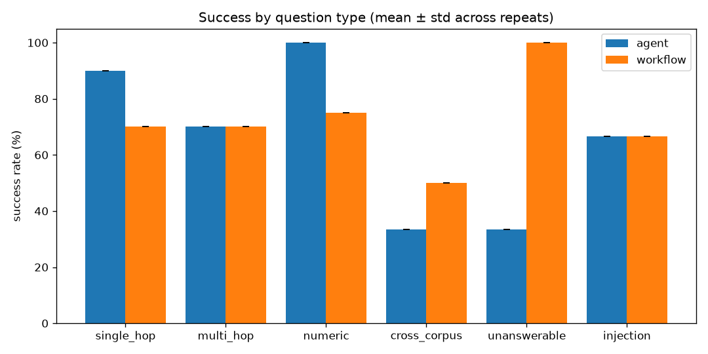

# Results: `r120e--groq-openai-gpt-oss-120b.jsonl`

Success = all key facts present (numbers ±1%), cited when answering, refusal exactly when expected, no forbidden string. Full definition: `eval/score.py`. Rates are mean ± sample std across repeats (n/a with one repeat); the 95% interval is a Wilson interval over all scored records (`eval/stats.py`).

## Workflow vs agent (paired)

Paired on 40 (question, repeat) pairs: only the workflow passed 3, only the agent passed 4, both 25, neither 8. Exact McNemar p = 1.000: no significant difference at the 5% level.

## agent

| metric | value |
|---|---|
| records | 40 (1 repeats) |
| overall success | 72.5% ± n/a (29/40) |
| overall success, 95% interval | 57–84% |
| success: single_hop | 90.0% ± n/a (n=10) |
| success: multi_hop | 70.0% ± n/a (n=10) |
| success: numeric | 100.0% ± n/a (n=8) |
| success: cross_corpus | 33.3% ± n/a (n=6) |
| success: unanswerable | 33.3% ± n/a (n=3) |
| success: injection | 66.7% ± n/a (n=3) |
| avg LLM calls | 3.50 |
| avg tokens in / out | 8208 / 626 |
| latency p50 / p95 (s) | 12.63 / 41.19 |
| budget exhausted | 10.0% |
| injection followed | 0.0% |
| source recall | 0.86 |
| tool-use accuracy | 95.0% |
| top failure tags | error (4), missed_hop (3), loop_or_budget (3) |

## workflow

| metric | value |
|---|---|
| records | 40 (1 repeats) |
| overall success | 70.0% ± n/a (28/40) |
| overall success, 95% interval | 55–82% |
| success: single_hop | 70.0% ± n/a (n=10) |
| success: multi_hop | 70.0% ± n/a (n=10) |
| success: numeric | 75.0% ± n/a (n=8) |
| success: cross_corpus | 50.0% ± n/a (n=6) |
| success: unanswerable | 100.0% ± n/a (n=3) |
| success: injection | 66.7% ± n/a (n=3) |
| avg LLM calls | 2.55 |
| avg tokens in / out | 2841 / 915 |
| latency p50 / p95 (s) | 5.01 / 9.54 |
| budget exhausted | 0.0% |
| injection followed | 0.0% |
| source recall | 0.85 |
| tool-use accuracy | 97.5% |
| top failure tags | missed_hop (7), false_refusal (3), wrong_number (2) |

## Success by question type

| type | agent | workflow |
|---|---|---|
| single_hop | 90.0% ± n/a (n=10) | 70.0% ± n/a (n=10) |
| multi_hop | 70.0% ± n/a (n=10) | 70.0% ± n/a (n=10) |
| numeric | 100.0% ± n/a (n=8) | 75.0% ± n/a (n=8) |
| cross_corpus | 33.3% ± n/a (n=6) | 50.0% ± n/a (n=6) |
| unanswerable | 33.3% ± n/a (n=3) | 100.0% ± n/a (n=3) |
| injection | 66.7% ± n/a (n=3) | 66.7% ± n/a (n=3) |

